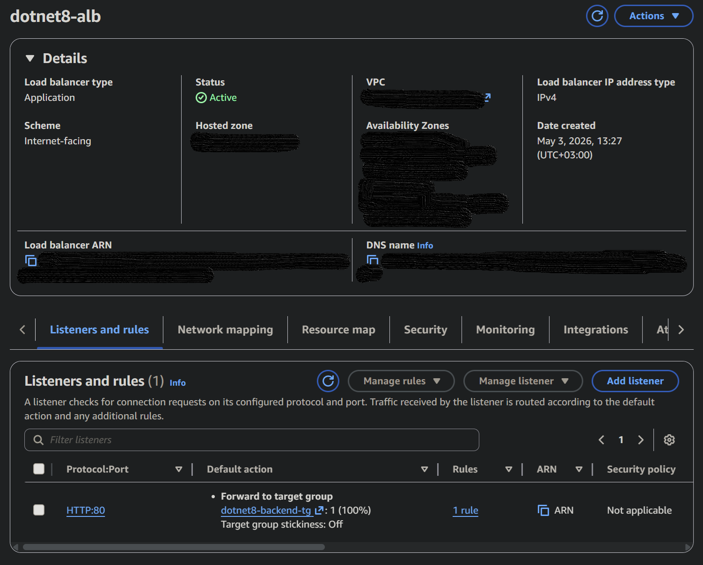
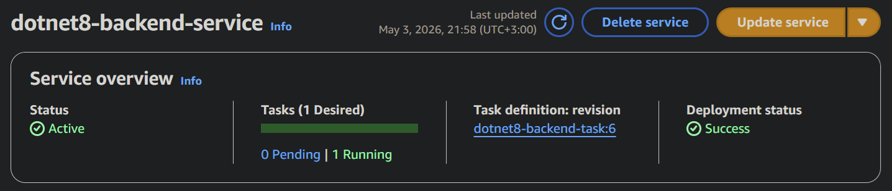
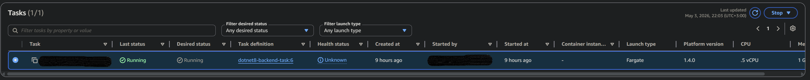
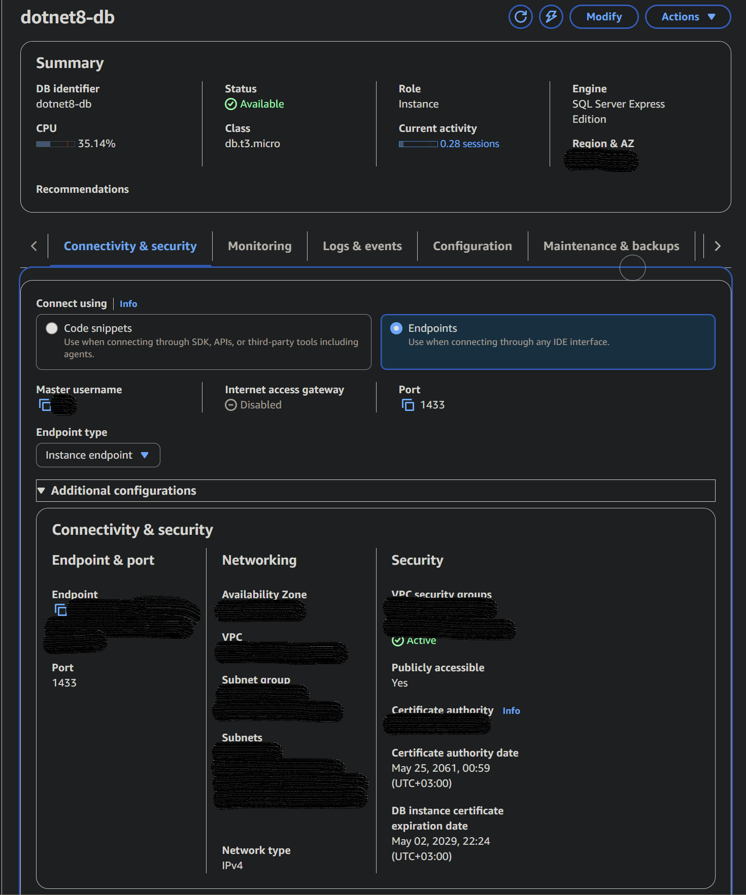
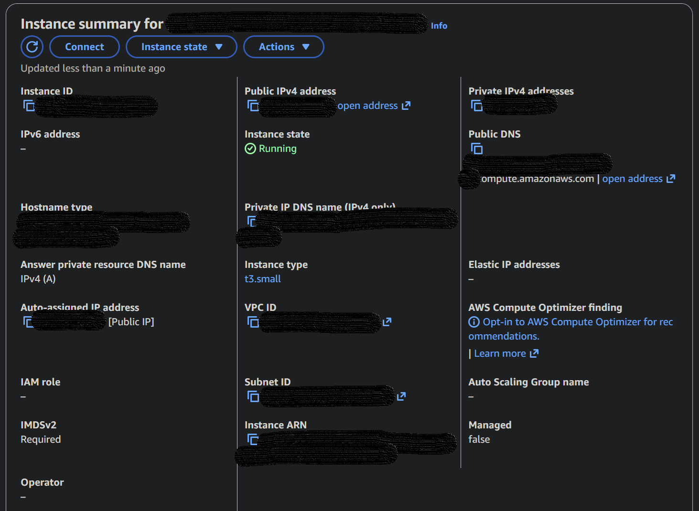
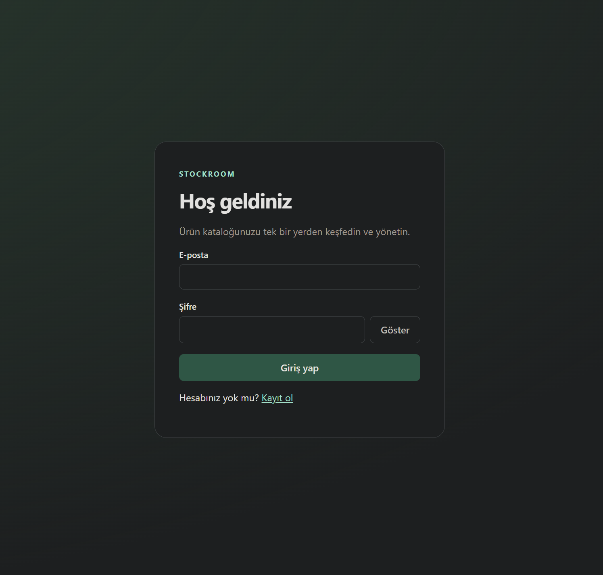
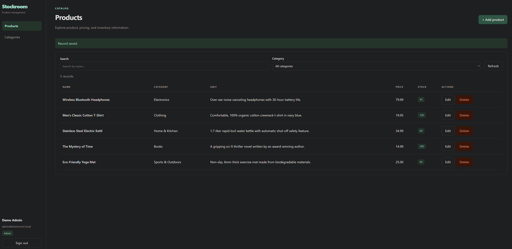
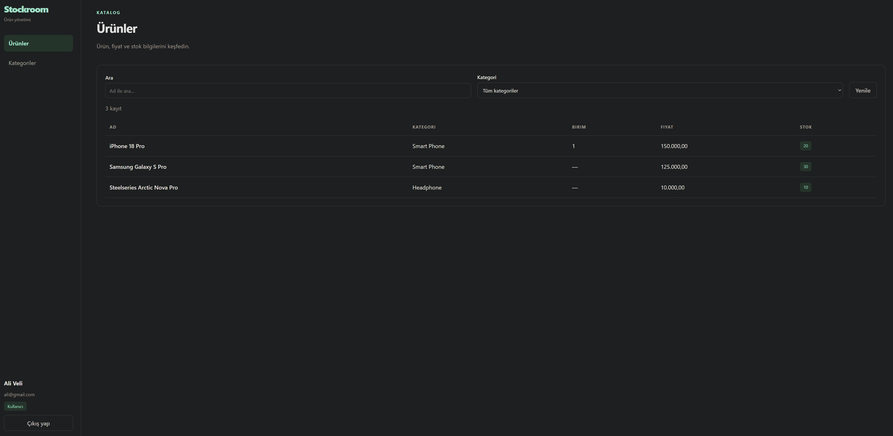
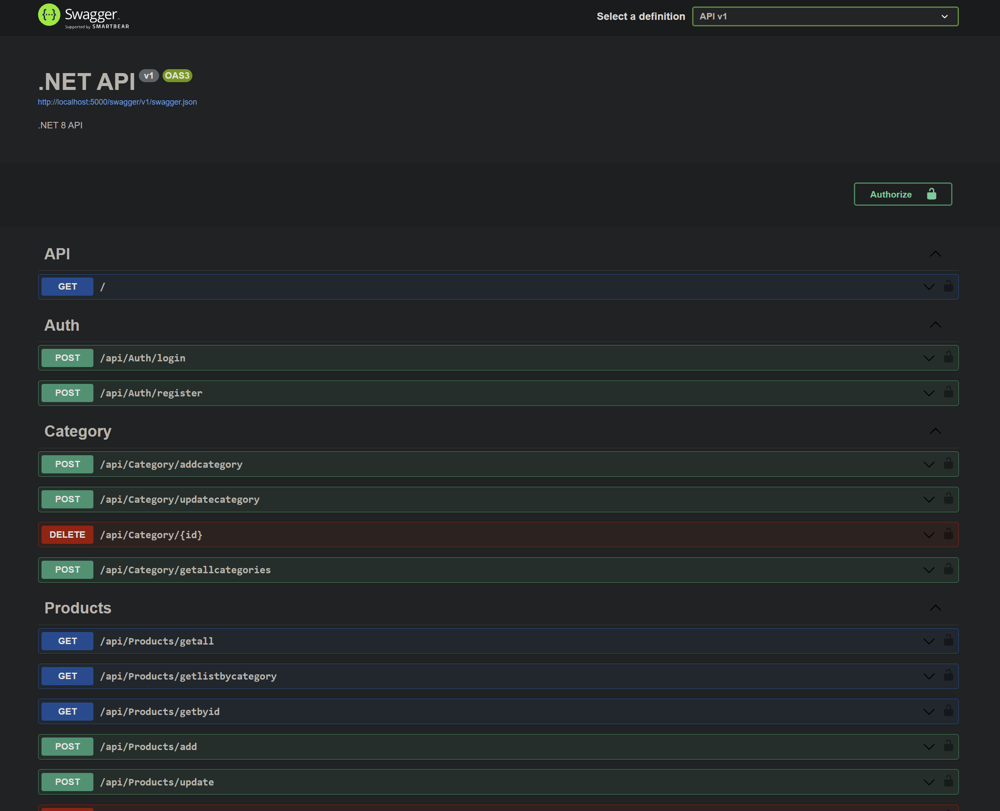

# Full Stack Dockerized Application (.NET 8 + React + AWS)

A containerized full-stack web application built with **.NET 8 Web API** and **React (Create React App)**.  
This portfolio sample demonstrates layered backend architecture, aspect-oriented programming (AOP), authentication, containerization, and deployment using AWS. Its goal is to make the architecture and structure easy to explore; it is not a finished product.

---

## 🚀 Tech Stack

### Backend
- .NET 8 Web API
- Layered Architecture (API, Business, DataAccess, Core, Entities)
- Dependency Injection (Autofac)
- JWT Authentication
- Role-based Authorization (RBAC)
- Aspect-Oriented Programming (AOP)

### Frontend
- React (Create React App)
- Axios for API communication
- Basic authentication UI (Login / Register)

### Database
- SQL Server

### DevOps / Infrastructure
- Docker
- Docker Compose
- AWS EC2
- AWS ECS Fargate

---

## 📌 Features

- User registration system
- User login authentication (JWT-based)
- Role-based authorization (RBAC)
- Full-stack integration (React ↔ .NET API)
- Containerized multi-service architecture
- Cloud-ready deployment structure

---

## 🏗 Architecture

The system follows a layered and containerized architecture:

```
[ React Frontend ]
        ↓
[ .NET 8 Web API ]
        ↓
[ Business Layer ]
        ↓
[ Data Access Layer ]
        ↓
[ SQL Server ]
```

---

### Backend Architecture

The backend demonstrates these layer responsibilities:

- API Layer: Handles HTTP requests and responses  
- Business Layer: Contains business logic  
- Data Access Layer: Manages database operations  
- Core Layer: Cross-cutting concerns and infrastructure  
- Entities Layer: Data models  

---

### ⚙️ Cross-Cutting Concerns (AOP)

The project uses Aspect-Oriented Programming to manage cross-cutting concerns:

- Validation Aspect  
- Caching Aspect  
- Performance Aspect  
- Transaction Scope Aspect (included as an unused learning example)
- Logging  
- Exception Handling Middleware  
- Method Interceptors  

---

### 🔐 Security

- JWT-based authentication  
- Role-based access control (RBAC)  
- SecuredOperation for authorization at method level  
- Password hashing implementation  

---

### Dockerized Environment

All services are containerized and orchestrated using Docker Compose:

- Frontend (React container)
- Backend (.NET API container)
- Database (SQL Server container)

---

### ☁️ Cloud Deployment

The application has been deployed and tested on AWS using:

- AWS EC2 (initial deployment/testing)
- AWS ECS Fargate (container orchestration)

---

## ▶️ Run Locally

Make sure Docker Desktop is running.

```bash
docker-compose up --build
```

Then access:

- Frontend: http://localhost:3000  
- Backend API: http://localhost:5000/swagger  

---

## Explore the Backend

Register a user through `POST /api/Auth/register`. Registration automatically grants `Product.Get` and `Category.Get`, so new users can read products and categories immediately using the returned token. It does not grant write or administrative permissions. Existing users are unchanged. To explore protected product and category endpoints locally, connect to the Docker SQL Server at `localhost,1433`, open the `Dotnet8DB` database, and run [grant-demo-admin.sql](backend/scripts/grant-demo-admin.sql) after replacing the sample email with your registered email.

Log in again through `POST /api/Auth/login` after assigning the claim. In Swagger, select **Authorize** and enter `Bearer <accessToken>`. The `Admin` claim allows the product and category demo operations; individual claims such as `Product.Add` and `Category.Get` allow only their corresponding operations. Demo administrator assignment is a manual, local setup step.

Run the backend checks from the repository root with the .NET 8 SDK:

```bash
dotnet build backend/Dotnet8-Backend.sln
dotnet test backend/Dotnet8-Backend.sln
```

The xUnit test project checks business rules with fake repositories, controller DTO mapping, authorization and validation through Castle proxies, cache invalidation, and EF model/migration SQL. Every test runs independently and requires no external database or Docker. Registration persistence tests use isolated in-memory SQLite databases. These checks do not replace a live SQL Server or HTTP integration test.

For a guided introduction to the tests, see [the testing guide](backend/RegressionTests/README.md).

### Architecture choices and sample limitations

Controllers map HTTP DTOs to business entities. Managers own business rules, and repositories own EF queries and persistence. Authorization aspects run before validation, logging, and caching. Product category checks use an existence query rather than calling a separately authorized category endpoint.

Attribute-based aspects use `ServiceTool` to resolve singleton dependencies from the application's existing container. This preserves the tutorial AOP approach without creating a second provider; the static service locator remains a deliberate sample limitation. Performance timing is local to each invocation.

The `/api/Products/transaction` endpoint is retained for compatibility and performs one update. That update relies on EF's normal `SaveChanges` transaction; it does not demonstrate a transaction spanning multiple writes. The unused `TransactionScopeAspect` is included for learning and requires retry-aware integration before use with the configured SQL retry policy.

Docker database credentials and the checked-in JWT key are local demonstration values. Supply separate configuration for any hosted deployment. CORS is permissive for the sample, database operations are synchronous, and category/product endpoints use different response envelopes. These are current limitations rather than product guarantees.

---

## 📸 Screenshots

### 🌐 Load Balancer (Entry Point)
Handles incoming traffic and routes it to the backend service.



---

### 🚀 Backend Service (ECS Fargate)
Containerized .NET API running in ECS.



---

### 🧩 Running Container (ECS Task)
Shows the active container instance.



---

### 🗄️ Database (AWS RDS - SQL Server)
Managed cloud database used by the backend.



---

### 💻 Frontend Server (EC2)
React application hosted on EC2 instance.



---

### 🌍 Frontend (Live Application)
User interface with authentication screen.







---

### 📡 API Documentation (Swagger)
API endpoints and testing interface.



---

## 📌 Key Learnings

- Designing layered backend architecture
- Applying Aspect-Oriented Programming (AOP)  
- Implementing secure authentication and authorization (JWT & RBAC)  
- Managing cross-cutting concerns (validation, caching, performance, transactions)  
- Using dependency injection with Autofac  
- Containerizing applications using Docker  
- Multi-container orchestration with Docker Compose  
- Deploying containerized applications to AWS (EC2 & ECS Fargate)  
- Building scalable and maintainable backend systems  
- Integrating frontend and backend in a real-world application  

---

## 📎 Notes

This project was built for learning and portfolio purposes to demonstrate full-stack development, layered backend architecture, and cloud deployment capabilities.
