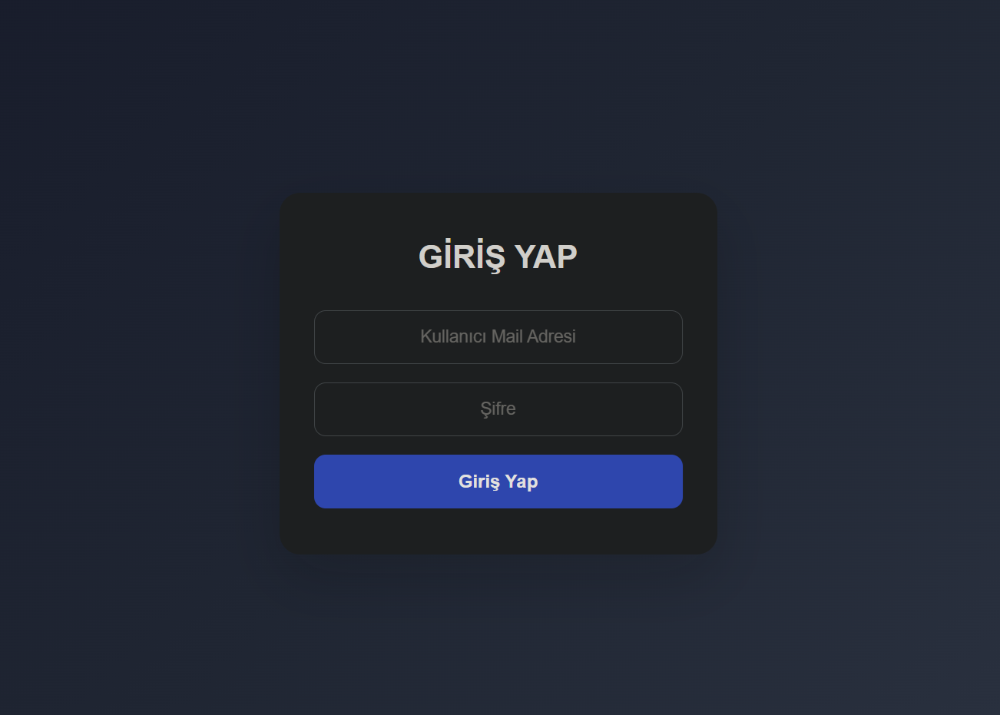
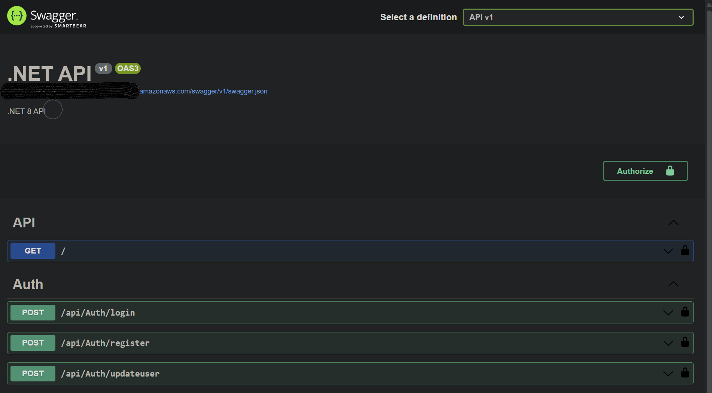

# Full Stack Dockerized Application (.NET 8 + React + AWS)

A containerized full-stack web application built with **.NET 8 Web API** and **React (Create React App)**.  
The project demonstrates end-to-end development including enterprise-level backend architecture, authentication, containerization, and cloud deployment using AWS.

---

## 🚀 Tech Stack

### Backend
- .NET 8 Web API
- Layered Architecture (API, Business, DataAccess, Core, Entities)
- Dependency Injection (Autofac)
- JWT Authentication
- Role-based Authorization (RBAC)
- Aspect-Oriented Programming (AOP)

### Frontend
- React (Create React App)
- Axios for API communication
- Basic authentication UI (Login / Register)

### Database
- SQL Server

### DevOps / Infrastructure
- Docker
- Docker Compose
- AWS EC2
- AWS ECS Fargate

---

## 📌 Features

- User registration system
- User login authentication (JWT-based)
- Role-based authorization (RBAC)
- Secure API communication
- Full-stack integration (React ↔ .NET API)
- Containerized multi-service architecture
- Cloud-ready deployment structure

---

## 🏗 Architecture

The system follows a layered and containerized architecture:

```
[ React Frontend ]
        ↓
[ .NET 8 Web API ]
        ↓
[ Business Layer ]
        ↓
[ Data Access Layer ]
        ↓
[ SQL Server ]
```

---

### Backend Architecture

The backend is designed to simulate an enterprise-level application structure:

- API Layer: Handles HTTP requests and responses  
- Business Layer: Contains business logic  
- Data Access Layer: Manages database operations  
- Core Layer: Cross-cutting concerns and infrastructure  
- Entities Layer: Data models  

---

### ⚙️ Cross-Cutting Concerns (AOP)

The project uses Aspect-Oriented Programming to manage cross-cutting concerns:

- Validation Aspect  
- Caching Aspect  
- Performance Aspect  
- Transaction Scope Aspect  
- Logging  
- Exception Handling Middleware  
- Method Interceptors  

---

### 🔐 Security

- JWT-based authentication  
- Role-based access control (RBAC)  
- SecuredOperation for authorization at method level  
- Password hashing implementation  

---

### Dockerized Environment

All services are containerized and orchestrated using Docker Compose:

- Frontend (React container)
- Backend (.NET API container)
- Database (SQL Server container)

---

### ☁️ Cloud Deployment

The application has been deployed and tested on AWS using:

- AWS EC2 (initial deployment/testing)
- AWS ECS Fargate (container orchestration)

---

## ▶️ Run Locally

Make sure Docker Desktop is running.

```bash
docker-compose up --build
```

Then access:

- Frontend: http://localhost:3000  
- Backend API: http://localhost:xxxx  

---

## 📸 Screenshots

### 🌐 Load Balancer (Entry Point)
Handles incoming traffic and routes it to the backend service.


---

### 🚀 Backend Service (ECS Fargate)
Containerized .NET API running in ECS.


---

### 🧩 Running Container (ECS Task)
Shows the active container instance.


---

### 🗄️ Database (AWS RDS - SQL Server)
Managed cloud database used by the backend.


---

### 💻 Frontend Server (EC2)
React application hosted on EC2 instance.


---

### 🌍 Frontend (Live Application)
User interface with authentication screen.



---

### 📡 API Documentation (Swagger)
API endpoints and testing interface.



---

## 📌 Key Learnings

- Designing enterprise-level layered architecture  
- Applying Aspect-Oriented Programming (AOP)  
- Implementing secure authentication and authorization (JWT & RBAC)  
- Managing cross-cutting concerns (validation, caching, performance, transactions)  
- Using dependency injection with Autofac  
- Containerizing applications using Docker  
- Multi-container orchestration with Docker Compose  
- Deploying containerized applications to AWS (EC2 & ECS Fargate)  
- Building scalable and maintainable backend systems  
- Integrating frontend and backend in a real-world application  

---

## 📎 Notes

This project was built for learning and portfolio purposes to demonstrate full-stack development, enterprise backend architecture, and cloud deployment capabilities.
